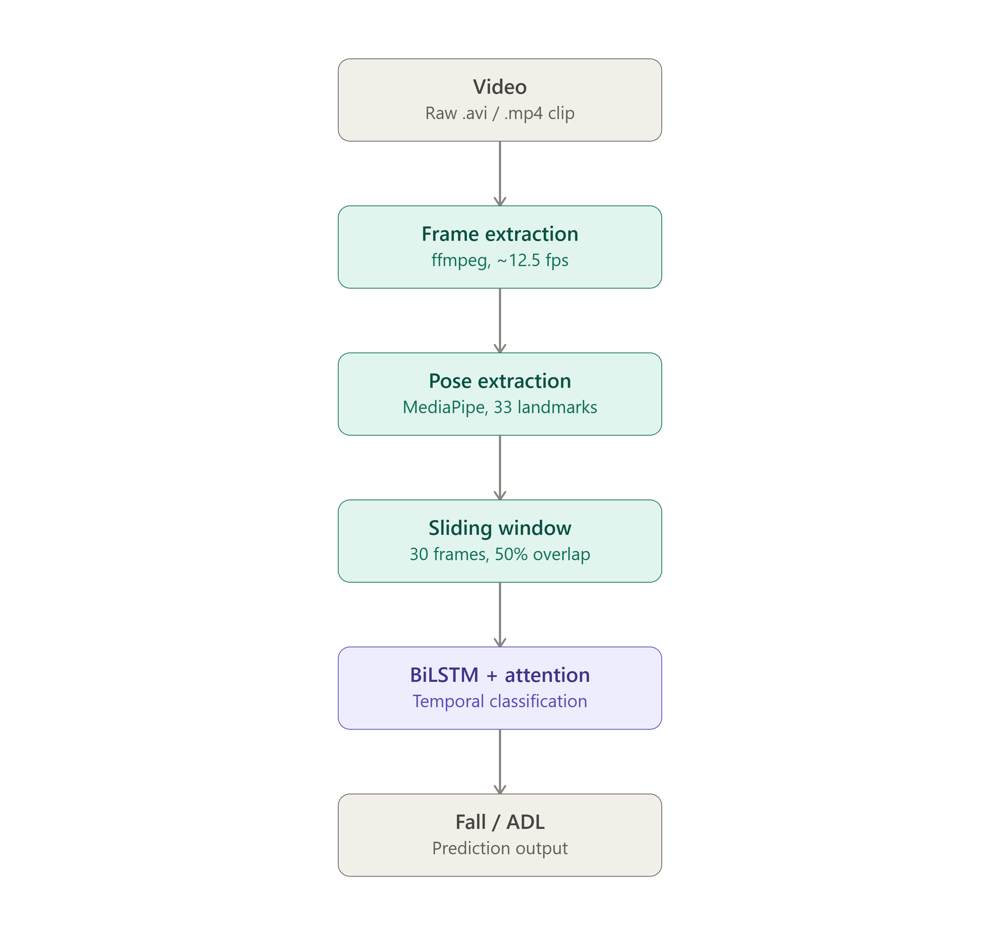
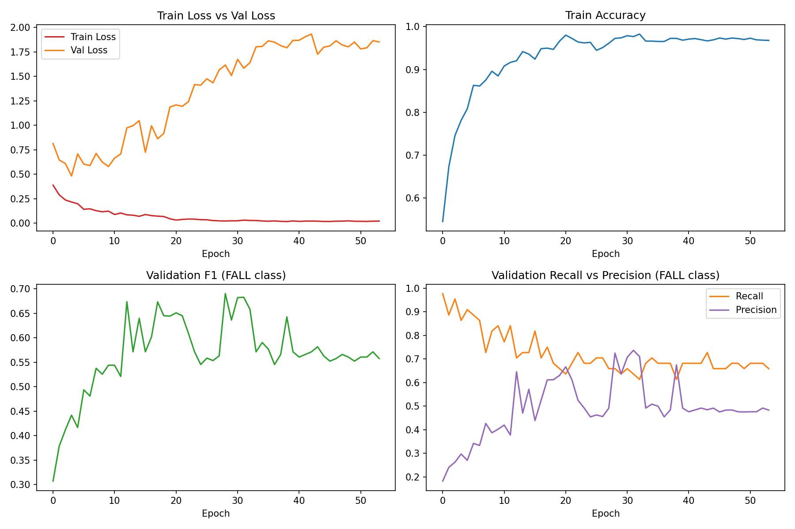

# Fall Detection using Pose Estimation and Bidirectional LSTM

A vision-based fall detection system that classifies short video sequences as a **fall** or a **normal activity of daily living (ADL)**, using pose-based motion analysis rather than raw pixel classification.

## Why pose-based, not raw video?

Classifying raw pixels requires learning both "what a person looks like" and "what falling looks like" simultaneously — a much harder problem given limited training data. By extracting body pose (joint coordinates) first, the classifier only has to learn the *motion pattern* of a fall, which is a smaller, more learnable problem, and is naturally robust to lighting, clothing, and background differences.

This also matters for the intended use case: fall detection is most valuable in elderly care and healthcare settings - homes, assisted living facilities, hospital wards - where continuous video monitoring raises real privacy concerns. Since pose extraction strips away all visually identifiable information (faces, clothing, room details) at the very first processing step, the model only ever operates on abstract joint coordinates, not raw footage. This makes the approach far more privacy-appropriate for deployment in sensitive, monitored spaces than a system trained directly on pixels.

## Pipeline

**Datasets:** [Le2i Fall Detection Dataset](https://www.kaggle.com/datasets/tuyenldvn/falldataset-imvia) (190 usable videos, frame-level fall annotations) combined with the [UR Fall Detection Dataset](https://www.kaggle.com/datasets/shahliza27/ur-fall-detection-dataset) (70 sequences) for additional real fall examples and improved class balance.

**Model:** 2-layer Bidirectional LSTM (hidden_dim=64) with an attention mechanism over the time dimension, trained with weighted loss and weighted sampling to address class imbalance (~85% ADL / ~15% FALL), using early stopping on validation F1.

## Results

Evaluated on a held-out test set (297 windows, never seen during training or validation):

| Metric    |  ADL  | FALL  |
|-----------|-------|-------|
| Precision | 0.957 | 0.762 |
| Recall    | 0.961 | 0.744 |
| F1        | 0.959 | 0.753 |

**Overall accuracy: 92.9%** — though for a safety-critical, imbalanced task like this, FALL-class F1 (0.753) is the metric that actually matters; accuracy alone is misleading on an ~85/15 class split.

## Honest limitations

- Trained on 260 total video/image sequences - a small dataset by deep learning standards; more real fall data would likely improve results further
- Validation loss shows signs of overfitting past ~epoch 20-30, though F1-based checkpoint selection and early stopping mitigate this
- **Qualitative testing on out-of-distribution footage revealed a consistent failure mode**: the model correctly detects genuine falls with high precision timing (e.g., flagged a real fall accurately within its exact ~2-second occurrence window), but also over-triggers on other fast vertical movements it never saw during training - jumping, bending down, and crouching all get misclassified as falls with high confidence. This happens because the training datasets (Le2i, URFD) only contain slow normal activity and sudden uncontrolled falls, with no "fast but intentional" movement as a contrasting example. A clear next step would be adding hard-negative training examples covering athletic movement and bending/crouching.

## Running it yourself

1. Download the datasets from the Kaggle links above (Le2i license: research use only, non-commercial)
2. Install dependencies: `pip install -r requirements.txt`
3. Run `fall_detection_pipeline.ipynb` — Option B cells (full rebuild) handle pose extraction and windowing from raw data; Option A is a fast-path restore if you already have processed data cached

## Tech stack

Python, PyTorch, MediaPipe, OpenCV, scikit-learn
